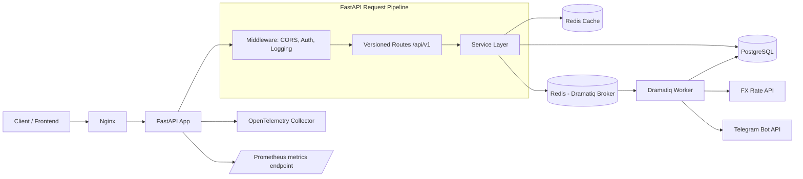
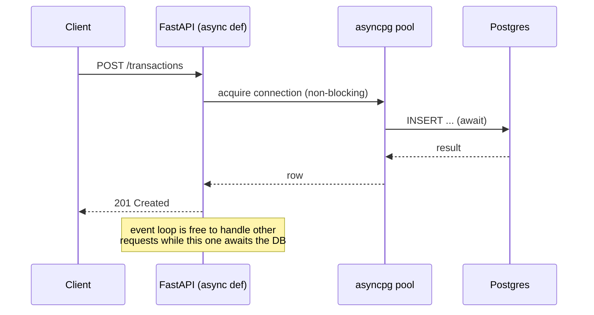
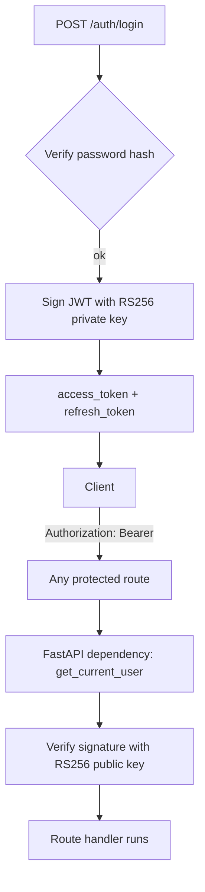
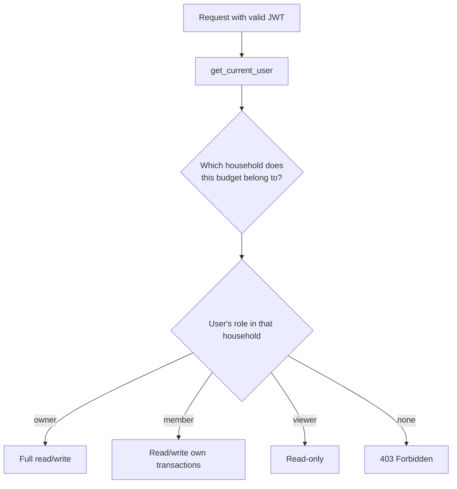
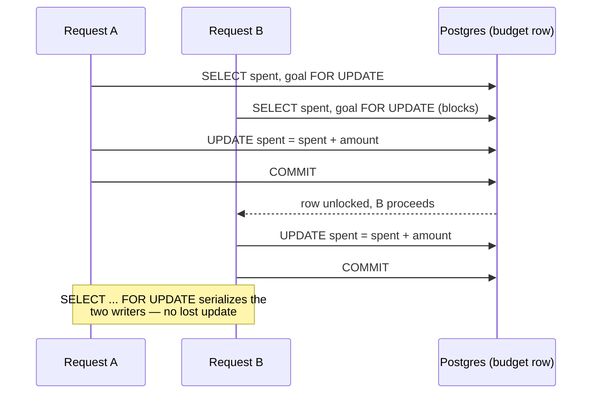
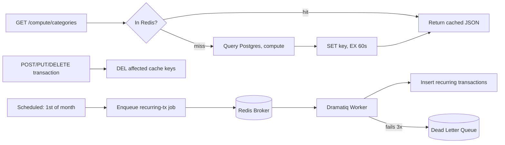
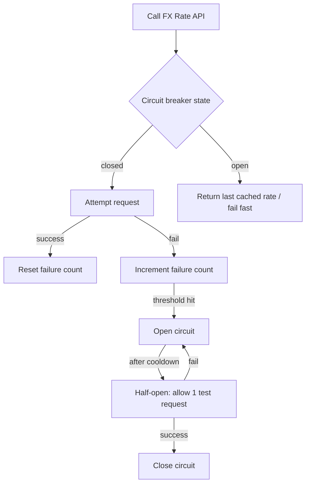
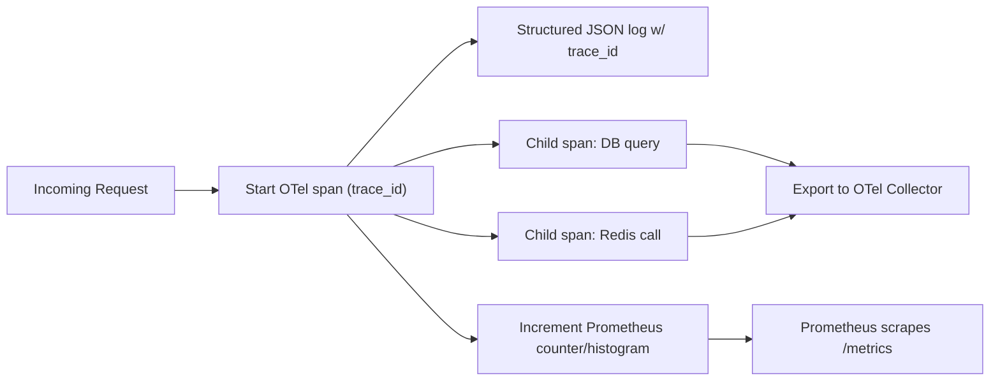

# Hesabi → Flagship Backend: 24-Point Mastery Roadmap

**Pace:** Thorough — 12 weeks, ~40-42 hrs/week
**Starting point:** Flask + raw `sqlite3`, single-tenant, no auth, no tests
**Target:** FastAPI + async SQLAlchemy 2.0 + PostgreSQL, multi-user, production-hardened

---

## How to use this guide

Each week follows the same five sections, in this order, on purpose:

1. **Big Picture** — the mental model, before any code. If this doesn't click, stop and ask before moving on.
2. **Prep** — docs to read + a throwaway script *outside* the repo, so you break things in a sandbox first.
3. **Integration Steps** — how it goes into Hesabi.
4. **Deliverables / DoD** — proof the system *behaves* correctly, not just that code runs.
5. **ADRs Due** — the decisions worth writing down before you forget why you made them.

The 24 items aren't tackled in their original order — they're sequenced so each week has what it needs from the week before (you can't test contracts that don't exist yet, can't break a circuit that isn't wired to anything real).

---

## Target Architecture (end state)

**Stack decisions locked in from your confirmation:**
- **Framework:** Flask → FastAPI (you already run this in Tether Tracker)
- **DB:** raw `sqlite3` → PostgreSQL via **async SQLAlchemy 2.0** (`asyncpg` driver) — done in Week 1, not deferred, since a real connection pool (item 19) doesn't exist on SQLite
- **Background worker:** **Dramatiq** — smaller surface area than Celery, easier to reason about while you're still building the mental model of "what is a worker." Celery is a one-line swap later if a job specifically wants it (it's the more common resume keyword, worth knowing exists)
- **Cache/broker:** Redis, doing double duty as cache store and Dramatiq broker

---

## Domain Expansion (why the roadmap items become "real")

Your current domain (single-user CRUD on transactions/categories/budgets) can't honestly justify all 24 items. These additions stay inside the finance domain and each maps to specific items:

| Addition | Unlocks |
|---|---|
| Multi-user + shared "household" budgets (owner/member/viewer roles) | Auth, RBAC, OWASP BOLA prevention |
| Concurrent transactions racing against one budget's cap | Scalability/locking, benchmarking |
| Idempotency key on transaction creation | Idempotency |
| Recurring transactions + monthly rollover job | Background workers, retries/DLQ |
| Async report export (CSV/PDF of a monthly statement) | A second, job-status-polling background pattern |
| Real FX rate lookup (replacing hardcoded `TOMAN`) | Circuit breakers, caching, resilience |
| Telegram budget-threshold notifications (reusing your bot experience) | A second external dependency to protect |
| Feature flags on FX/notifications rollout | Feature flagging |
| v1 freeze → v2 adds multi-user | API versioning |

---

## Week Index

| Week | Theme | Items |
|---|---|---|
| 1 | Foundation I — FastAPI + Postgres + Async SQLAlchemy | 4 |
| 2 | Foundation II — Alembic + Pydantic Settings | 12, 13 |
| 3 | Request Pipeline — Middleware, CORS, Error Handling | 1, 2, 15 |
| 4 | Contracts — OpenAPI + API Versioning | 14, 23 |
| 5 | Auth I — JWT RS256 | 3 (pt. 1) |
| 6 | Auth II — RBAC + Multi-user + OWASP pass 1 | 3 (pt. 2), 20 (pt. 1) |
| 7 | Testing — Unit / Integration / Contract | 5 |
| 8 | Scalability & Concurrency | 21 |
| 9 | Caching & Background Processing | 9, 10 |
| 10 | Idempotency & Resilience | 17, 22 |
| 11 | Observability & Lifecycle | 11, 16, 18 |
| 12 | Performance, Packaging & Hardening | 6, 7, 8, 19, 20 (pt. 2), 24 |

---

## Week 1 — Foundation I: FastAPI + PostgreSQL + Async SQLAlchemy 2.0

**Roadmap item:** 4 (SQL / Async SQLAlchemy 2.0)

### Big Picture

- Your current `conn_db.py` shares **one** sqlite3 connection across every request. It works because nothing is concurrent yet. The moment two requests hit at once, that model breaks.
- Async SQLAlchemy doesn't make one query faster — it lets the event loop serve *other* requests while one request is waiting on I/O. The win only shows up under concurrent load, which is exactly what Week 8/12 will prove with benchmarks.
- SQLAlchemy 2.0 "Core + ORM unified" style uses explicit `Session`/`AsyncSession` objects and `select()` statements instead of `Query`. If you've only seen 1.x tutorials online, ignore them — the API is different enough to cause real confusion.
- Repository layer survives almost unchanged conceptually: it still owns all DB access. It just becomes `async def` and takes an `AsyncSession` instead of a raw `sqlite3.Connection`.

### Prep

- Read: FastAPI's own async SQL tutorial (fastapi.tiangolo.com → SQL (Relational) Databases with SQLAlchemy)
- Read: SQLAlchemy 2.0 async ORM quickstart (docs.sqlalchemy.org → "Asyncio Support")
- **Throwaway exercise** (outside the repo, a single `scratch.py`): spin up Postgres in Docker, connect with `asyncpg` via SQLAlchemy's async engine, define one dummy `Widget` model, insert 3 rows and select them back with `async with AsyncSession(engine) as session:`. Don't touch Hesabi until this runs clean.

### Integration Steps

1. Add a `postgres` service to `docker-compose.yml`; keep SQLite data disposable, don't migrate old data.
2. Create the FastAPI skeleton (`main.py` with `FastAPI()`, no routes yet).
3. Rewrite `conn_db.py` → `db.py`: `create_async_engine()` + `async_sessionmaker`.
4. Convert `categories`, `budgets`, `transactions` tables into SQLAlchemy `Mapped`/`mapped_column` models (SQLAlchemy 2.0 declarative style).
5. Rewrite `repository.py`: every method becomes `async def`, uses `select()`/`session.execute()`/`session.commit()` instead of raw cursors.
6. Wire a FastAPI dependency `get_session()` that yields an `AsyncSession` per request (this is your first real look at FastAPI's dependency injection — you'll lean on this pattern constantly from here on).
7. Port one vertical slice end-to-end first — just `transactions` — before touching categories/budgets, so you find integration bugs on a small surface.
8. Leave `service.py`'s business logic (validation rules) untouched conceptually; only the repository calls it makes become `await`ed.

### Deliverables / DoD

- `docker compose up` brings up FastAPI + Postgres with zero manual steps.
- `POST /transactions` (routed through FastAPI, even without full API polish yet) writes a row you can verify with `psql`.
- Run 20 concurrent inserts (a 5-line `asyncio.gather` script) against the running server and confirm all 20 succeed — this is the proof the shared-connection bug from the old code is actually gone.
- Old Flask app and `sqlite3` dependency fully removed from `requirements.txt`.

### ADRs Due

- ADR-001: Why FastAPI over Flask for this project
- ADR-002: Why PostgreSQL over SQLite, and why now (not deferred to the pooling week)

---

## Week 2 — Foundation II: Alembic Migrations + Pydantic Settings

**Roadmap items:** 12 (Configuration Management), 13 (Database Migrations)

### Big Picture

- Your current `setup_db.py` is a run-once script — there's no way to evolve the schema without hand-editing production data. Alembic gives you versioned, reversible schema changes (`upgrade`/`downgrade`), which is the only sane way to run a real database over time.
- Pydantic Settings replaces scattered `os.environ.get(...)` calls (you have exactly one right now, in `conn_db.py`) with a single typed, validated `Settings` object loaded once at startup — misconfigured env vars fail loudly at boot instead of silently at 2am.
- These two are boring on purpose this week — they're infrastructure, not features. Resist the urge to add new endpoints.

### Prep

- Read: Alembic's official tutorial (autogenerate, `upgrade head`, `downgrade -1`)
- Read: Pydantic Settings docs (`BaseSettings`, `.env` loading, nested settings)
- **Throwaway exercise:** in your scratch project from Week 1, add Alembic, autogenerate a migration for the `Widget` table, then manually write a migration that adds a nullable column and downgrade it back out. Prove `downgrade` actually works before trusting it on Hesabi.

### Integration Steps

1. `alembic init` in the repo; point `env.py` at your SQLAlchemy models' metadata.
2. Autogenerate the initial migration from your Week 1 models — this becomes your schema baseline.
3. Build a `Settings(BaseSettings)` class: `DATABASE_URL`, `ENV`, `REDIS_URL` (stub for later), `LOG_LEVEL`.
4. Replace every hardcoded config value in the app with `settings.<field>`.
5. Add `.env.example` to the repo (never commit `.env` itself).
6. Write one real migration by hand: add a `households` table (empty for now, foreshadowing Week 6's multi-user work) — practice authoring a migration, not just autogenerating one.

### Deliverables / DoD

- `alembic upgrade head` and `alembic downgrade base` both run clean on a fresh Postgres instance.
- Starting the app with a missing required env var fails at boot with a clear Pydantic validation error — not a stack trace three requests later.
- Schema state lives entirely in migration files; `setup_db.py` is deleted.

### ADRs Due

- ADR-003: Migration strategy (autogenerate + manual review, not blind trust)
- ADR-004: Configuration approach (Pydantic Settings, env-var precedence rules)

---

## Week 3 — Request Pipeline: Middleware, CORS/Headers, Centralized Errors

**Roadmap items:** 1 (Middleware), 2 (CORS/Headers), 15 (Centralized Error Handling)

### Big Picture

- Middleware wraps *every* request/response, before/after your route code runs — think of it as concentric layers around the handler: logging middleware wraps auth middleware wraps CORS wraps your actual route.
- Right now every route in `api/transaction.py` has its own hand-rolled `try/except` returning `jsonify({'error': ...})`. That's the exact problem exception handlers solve: one exception hierarchy (`AppError` → `NotFoundError`, `ValidationError`, `ConflictError`...), one place that turns them into consistent JSON, zero per-route boilerplate.
- CORS isn't "turn it on" — it's "which origins, which methods, which headers, credentialed or not." Getting specific here now avoids a `allow_origins=["*"]` security hole later.

### Prep

- Read: FastAPI docs on Middleware and on Exception Handlers
- Read: MDN's CORS explainer (understand preflight `OPTIONS` requests once, properly)
- **Throwaway exercise:** a 20-line FastAPI app with one route that sometimes raises a custom `NotFoundError`; write an `@app.exception_handler` for it and confirm the JSON shape is consistent regardless of which route raised it.

### Integration Steps

1. Define an exception hierarchy in `exceptions.py`: base `AppError`, subclasses for not-found, validation, conflict, unauthorized.
2. Register one `@app.exception_handler(AppError)` — delete every per-route `try/except` for these cases.
3. Add `CORSMiddleware` with an explicit origin list (your nginx-served frontend's actual origin, not `*`).
4. Add a small custom middleware that assigns a `request_id` (UUID) to every request and puts it in the response headers — you'll reuse this in Week 11 for tracing.
5. Add baseline security headers (`X-Content-Type-Options`, `X-Frame-Options`) via middleware — full OWASP pass comes in Week 6/12, this is just the header plumbing.
6. Convert existing `service.py` `ValueError`s into your new typed exceptions.

### Deliverables / DoD

- Trigger a not-found, a validation error, and an unhandled 500 — all three come back as consistent JSON shapes with correct status codes, with zero `try/except` left in the route files.
- A request from a disallowed origin is rejected by CORS (verify with `curl -H "Origin: https://evil.example"`).
- Every response carries an `X-Request-Id` header.

### ADRs Due

- ADR-005: Exception hierarchy design and error response contract

---

## Week 4 — Contracts: OpenAPI Customization + API Versioning

**Roadmap items:** 14 (API Documentation), 23 (API Versioning)

### Big Picture

- FastAPI generates OpenAPI/Swagger for free from your type hints — this week is about *customizing* it (descriptions, examples, response models, tags) so `/docs` is actually usable by someone who isn't you, not about generating it from scratch.
- Versioning decision now, before Week 6 adds multi-user: freeze the current shape as `/api/v1`, and design the router structure so `/api/v2` can exist side-by-side later without duplicating everything.

### Prep

- Read: FastAPI docs on `response_model`, `tags`, `Path`/`Query` metadata, and `openapi_extra`
- Read a short comparison of API versioning strategies (URL path vs header vs media-type) — pick one deliberately, don't default without knowing the trade-off
- **Throwaway exercise:** none needed — this week is entirely inside FastAPI's own conventions, low risk to experiment directly.

### Integration Steps

1. Restructure routers under `app/api/v1/` — every route gets an explicit `/api/v1` prefix.
2. Add Pydantic response models for every endpoint (replacing raw dict returns) so the OpenAPI schema reflects real response shapes.
3. Add `summary`, `description`, and at least one `example` per endpoint.
4. Group routes with `tags=["transactions"]` etc. so `/docs` is navigable.
5. Write a short `VERSIONING.md` ADR-adjacent doc: what triggers a v2 (breaking response shape changes), what doesn't (adding optional fields).
6. Add a `Deprecation` header helper (unused for now, ready for whenever v1 routes eventually get deprecated).

### Deliverables / DoD

- `/docs` is something you'd hand to another developer without narrating it out loud.
- Every route lives under `/api/v1/...`; no bare `/transactions`.
- OpenAPI schema (`/openapi.json`) validates against the OpenAPI 3.1 spec (there are online validators — use one).

### ADRs Due

- ADR-006: API versioning strategy (path-based, what counts as breaking)

---

## Week 5 — Auth I: JWT RS256

**Roadmap item:** 3 (part 1 — JWT RS256)

### Big Picture

- RS256 vs HS256: HS256 is one shared secret (anyone who can verify a token can also forge one). RS256 is a key pair — the API signs with a private key, but the public key can be handed to other services to verify tokens *without* being able to mint new ones. Worth knowing why you're choosing the harder one.
- Access tokens are short-lived and sent on every request; refresh tokens are longer-lived and only used to mint new access tokens. This week is just the mechanics — RBAC (who's *allowed* to do what) is next week.

### Prep

- Read: PyJWT docs on RS256 (key generation with `openssl`, `encode`/`decode`)
- Read: FastAPI's OAuth2/JWT tutorial (for the dependency-injection pattern, not the HS256 example itself)
- **Throwaway exercise:** generate an RSA key pair with `openssl`, sign a token with the private key, verify it with the public key, then deliberately verify it with the *wrong* public key and confirm it fails loudly.

### Integration Steps

1. Generate an RSA key pair (dev keys committed to `.env.example` as placeholders only — real keys never in git).
2. Add a `users` table (Alembic migration): id, email, password_hash, created_at.
3. `POST /api/v1/auth/register`, `POST /api/v1/auth/login` (bcrypt/argon2 password hashing — never roll your own).
4. Issue access token (short TTL, e.g. 15 min) + refresh token (longer TTL) on login.
5. `POST /api/v1/auth/refresh` to mint a new access token from a valid refresh token.
6. FastAPI dependency `get_current_user` that decodes/verifies the bearer token and loads the user — apply it to one route as a smoke test only (all routes get protected next week alongside RBAC).

### Deliverables / DoD

- A token signed with the wrong private key is rejected.
- An expired access token is rejected with a clear 401, distinct from "invalid token."
- Refresh flow actually rotates: using a refresh token issues a new access token without requiring the password again.

### ADRs Due

- ADR-007: RS256 over HS256, and token TTL choices

---

## Week 6 — Auth II: RBAC + Multi-user Domain Expansion + OWASP Pass 1

**Roadmap items:** 3 (part 2 — RBAC), 20 (part 1 — OWASP API Top 10)

### Big Picture

- This is where the domain expansion actually happens: a `households` table (stubbed in Week 2), a `household_members` join table with a `role` column, and every category/budget/transaction now belongs to a household instead of floating free.
- This is also where BOLA (Broken Object-Level Authorization) becomes real: without multi-user, there's no such thing as "someone else's budget" to accidentally expose. Now there is, and the authorization check has to be on *every* object-fetching route, not just the household-level gate.

### Prep

- Read: OWASP API Security Top 10 (2023) — specifically API1 (BOLA) and API3 (Broken Object Property Level Authorization / mass assignment)
- **Throwaway exercise:** none — this is best learned directly against the real schema, since the risk (someone else's data leaking) only exists once real multi-tenancy exists.

### Integration Steps

1. Migration: `households`, `household_members(user_id, household_id, role)`; add `household_id` FK to `categories`.
2. Update `service.py` validation: every category/budget/transaction operation must check the acting user's role in the owning household.
3. Write a single reusable FastAPI dependency `require_role(*roles)` — apply it per-route instead of duplicating checks.
4. Deliberately audit every "get by id" route for BOLA: does it check that the requested object belongs to the caller's household, or does it just check "does this ID exist"?
5. Mass-assignment check: confirm your Pydantic request models don't accept a `household_id` or `role` field from the client on write endpoints (the server decides those, not the request body).
6. Apply `get_current_user` to *all* remaining protected routes now (deferred from Week 5).

### Deliverables / DoD

- User A, authenticated, requesting User B's transaction by ID gets a 404 (not a 403 — don't confirm the object exists to someone unauthorized to see it).
- A `viewer`-role user gets 403 on any write attempt.
- Sending a request body with `"role": "owner"` on a member-invite endpoint has zero effect — role is set server-side only.

### ADRs Due

- ADR-008: Household/RBAC data model and role permission matrix
- ADR-009: BOLA prevention approach (ownership-check pattern used consistently)

---

## Week 7 — Testing: Unit / Integration / Contract

**Roadmap item:** 5 (Testing)

### Big Picture

- **Unit tests**: `service.py` logic in isolation, repository mocked out — fast, no DB.
- **Integration tests**: real Postgres (test container or test DB), real async session, prove the repository layer actually talks to the database correctly.
- **Contract tests**: hit the API over HTTP (via `httpx.AsyncClient`), assert the *response shape* matches what the OpenAPI schema promises — this is what catches "the docs say one thing, the code does another."
- These are three different questions ("is my logic right," "does my SQL actually work," "does my API keep its promises") — conflating them is exactly what leads to a test suite that's slow *and* doesn't catch real bugs.

### Prep

- Read: `pytest-asyncio` docs (fixture scoping for async)
- Read: `httpx.AsyncClient` docs for testing ASGI apps directly (no real network needed)
- **Throwaway exercise:** write one unit test and one integration test for a single trivial function, to nail down fixture setup/teardown before applying it across the whole codebase.

### Integration Steps

1. Set up a separate test database (or `testcontainers-python` spinning up throwaway Postgres per test run).
2. `conftest.py`: async session fixture with transaction rollback per test (each test starts clean without re-migrating).
3. Unit tests: every validation rule in `service.py` (negative amounts, future dates, non-existent categories, income-with-category, etc. — you already have these as manual `ValueError` cases in the old `run_test()`; formalize them).
4. Integration tests: repository methods against real Postgres — confirm cascade deletes, foreign key constraints actually fire.
5. Contract tests: for each `/api/v1` route, assert status codes and response shapes for both success and every error case from Week 3's exception hierarchy.
6. Wire `pytest --cov` into a simple CI check (even just a `pre-commit` hook or GitHub Action) with a coverage floor.

### Deliverables / DoD

- Three distinct test directories (`tests/unit`, `tests/integration`, `tests/contract`) each runnable independently.
- Full suite runs in CI on every push.
- Coverage floor enforced (pick a number you'll actually maintain — 80% is a reasonable target, not a magic requirement).
- Deleting the old `run_test()` print-based script from `main.py`.

### ADRs Due

- ADR-010: Testing strategy (what's unit vs integration vs contract, and why)

---

## Week 8 — Scalability & Concurrency

**Roadmap item:** 21 (Scalability Patterns: Indexing, Query Optimization)

### Big Picture

- This is your "flash sale" problem, in finance-native form: two transactions racing to post against the same budget can both read "spent = 100" before either writes, and both write back the same stale increment — a real lost-update bug, not a hypothetical one.
- The fix is either pessimistic locking (`SELECT ... FOR UPDATE`) or optimistic concurrency (a version column, retry on conflict). Learn both, pick one deliberately, document the trade-off.
- Indexing/query optimization gets tackled here too because it's the same muscle: understanding what Postgres is actually doing under a query, via `EXPLAIN ANALYZE`, not guessing.

### Prep

- Read: Postgres docs on row-level locking (`FOR UPDATE`, `FOR SHARE`) and on `EXPLAIN ANALYZE`
- **Throwaway exercise:** write a script that fires 50 concurrent `asyncio` tasks incrementing a single counter row with no locking — watch it lose updates. Then add `FOR UPDATE` and watch it stop losing them. Seeing the bug before the fix makes the fix mean something.

### Integration Steps

1. Reproduce the race against the real `budgets.spent` (or equivalent aggregate) column with a concurrent test script.
2. Implement `SELECT ... FOR UPDATE` in the repository method that increments budget spend on transaction insert.
3. Add indexes: `transactions(category_id)`, `transactions(household_id, transaction_date)` — whatever your actual query patterns from `compute.py` need; check with `EXPLAIN ANALYZE` before and after.
4. Find and fix any N+1 query pattern in the compute/balance endpoints (loading categories then looping to fetch each one's transactions separately, vs one joined query).
5. Re-run the Week 1 concurrent-insert test, now against a budget near its cap, and confirm the spend total is exactly correct, not racy.

### Deliverables / DoD

- The concurrent-race script that used to lose updates now produces the mathematically correct total, every run, 20/20 times.
- `EXPLAIN ANALYZE` output before/after indexing, saved as evidence in the ADR.
- No N+1 query pattern remains in the compute endpoints (verifiable via query count logging in tests).

### ADRs Due

- ADR-011: Locking strategy for concurrent budget updates (pessimistic vs optimistic, and why)
- ADR-012: Indexing decisions with before/after query plans

---

## Week 9 — Caching & Background Processing

**Roadmap items:** 9 (Caching / Redis), 10 (Background Tasks & Worker Queues)

### Big Picture

- Cache-aside pattern: read path checks cache first, falls back to DB and populates cache on miss. The hard part isn't the read path — it's invalidation on write, which is why this is paired with a specific write-heavy domain event (any transaction change invalidates that category's cached balance).
- Background workers exist for anything that shouldn't block the HTTP response: recurring transactions posted on a schedule, or a report export that takes seconds to generate. The client gets an immediate "job accepted" response and polls (or gets notified) for completion.
- Retries + DLQ: a job that fails should retry with backoff, and after N failures land in a dead-letter queue for inspection — not silently vanish, not retry forever.

### Prep

- Read: Redis docs on `EXPILE`/`TTL`/`DEL` and the cache-aside pattern
- Read: Dramatiq docs (actors, `@dramatiq.actor`, retries, middleware)
- **Throwaway exercise:** a standalone Dramatiq actor that sometimes raises, with `max_retries=3`, watch it retry with backoff and land in the DLQ on final failure — before wiring anything into Hesabi.

### Integration Steps

1. Add Redis to `docker-compose.yml`; wire `settings.REDIS_URL`.
2. Cache the compute/balance endpoints (`compute.py`) — cache-aside, short TTL.
3. Invalidate the relevant cache keys inside the service layer on any transaction write affecting that category.
4. Set up Dramatiq with Redis as broker; add a worker service to `docker-compose.yml`.
5. Build the recurring-transactions job: a scheduled actor (APScheduler or Dramatiq's periodic pattern) that posts recurring transactions on their due date.
6. Build the report-export job: `POST /api/v1/reports/export` enqueues a job, returns a job ID immediately; `GET /api/v1/reports/{job_id}` polls status; worker generates CSV, stores it, marks job complete.
7. Configure retries + DLQ on both actors.

### Deliverables / DoD

- Repeated `GET` on a compute endpoint shows a measurable latency drop on cache hit vs miss (log it, you'll use this number again in Week 12's benchmarking).
- A transaction write immediately invalidates the correct cache key — a subsequent `GET` reflects the new number, not stale cache.
- Killing the worker mid-job and restarting it doesn't lose the job (Dramatiq's Redis broker persistence).
- A deliberately-failing job retries 3x with visible backoff, then appears in the DLQ.

### ADRs Due

- ADR-013: Cache invalidation strategy (what gets cached, TTL choice, invalidation triggers)
- ADR-014: Background job design (Dramatiq over Celery, retry/DLQ policy)

---

## Week 10 — Idempotency & Resilience

**Roadmap items:** 17 (Idempotency, Retries, Circuit Breakers, Bulkheads), 22 (Feature Flagging)

### Big Picture

- Idempotency key: the client sends an `Idempotency-Key` header on `POST /transactions`; if the same key arrives twice (retry from a flaky connection), the server returns the *original* result instead of creating a duplicate transaction. This is a real financial-app requirement, not an academic exercise.
- Circuit breaker: after a dependency (FX rate API, Telegram) fails repeatedly, stop calling it for a cooldown period and fail fast (or fall back) instead of piling up slow, doomed requests — this is what protects your app when someone else's API goes down.
- Bulkhead: isolate resources per dependency (e.g., a separate connection/thread pool per external call) so one slow dependency can't exhaust resources needed by unrelated requests.
- Feature flags: a simple DB-backed (or `settings`-driven) toggle so FX/notifications can roll out to a subset of households before going live for everyone — and can be killed instantly if something's wrong, without a deploy.

### Prep

- Read: Martin Fowler's or Microsoft's write-up on the Circuit Breaker pattern (the state machine: closed/open/half-open)
- Read: Stripe's public docs on idempotency keys (a widely-cited real-world implementation of exactly this pattern)
- **Throwaway exercise:** a tiny wrapper function implementing the closed/open/half-open state machine around a function that fails on command — prove the state transitions before wiring it to a real API.

### Integration Steps

1. Add an `idempotency_keys` table (key, request hash, response, expiry); check it first in `POST /transactions`, short-circuit on match.
2. Integrate a real FX rate API for multi-currency support (pick a free-tier provider) — wrap the call in retry-with-backoff.
3. Wrap the FX call in a circuit breaker (a small library like `pybreaker`, or hand-rolled from the throwaway exercise).
4. Integrate Telegram notifications for budget-threshold breaches (background job from Week 9 territory, triggered by the resilience-wrapped call here).
5. Add a `feature_flags` table (or settings-driven flags to start) gating FX support and notifications per household.
6. Bulkhead: give the FX/Telegram HTTP clients their own connection pool limits, separate from your DB pool.

### Deliverables / DoD

- Sending the same `POST /transactions` request twice with the same `Idempotency-Key` creates exactly one transaction, and both responses are identical.
- Deliberately pointing the FX client at a dead URL: after N failures the circuit opens, subsequent calls fail fast (measurably faster than the timeout) instead of hanging.
- Flipping a household's feature flag off immediately stops FX/notification behavior for that household with no deploy.

### ADRs Due

- ADR-015: Idempotency key design (storage, TTL, hashing)
- ADR-016: Circuit breaker thresholds and fallback behavior for each external dependency

---

## Week 11 — Observability & Lifecycle

**Roadmap items:** 11 (Observability), 16 (Graceful Shutdown & Lifespan), 18 (Health Checks)

### Big Picture

- Three distinct signals, don't blur them: **logs** (discrete events, "this happened"), **traces** (the path one request took across services/spans, with timing), **metrics** (aggregated numbers over time, "p99 latency," "requests/sec"). Each answers a different debugging question.
- The `request_id` from Week 3's middleware becomes the thread that ties a log line to a trace span to a specific request — this is the payoff for adding it early.
- Liveness vs readiness are different questions: "is the process alive" (liveness — restart it if not) vs "is it ready to serve traffic" (readiness — e.g., not ready if the DB pool isn't connected yet, or mid-graceful-shutdown).
- Graceful shutdown: on `SIGTERM`, stop accepting new requests, finish in-flight ones, close DB/Redis connections cleanly — done via FastAPI's `lifespan` context manager.

### Prep

- Read: `structlog` docs (structured JSON logging)
- Read: OpenTelemetry Python docs (auto-instrumentation for FastAPI + SQLAlchemy)
- Read: `prometheus_client` Python docs (Counter, Histogram, the `/metrics` endpoint convention)
- **Throwaway exercise:** none required — instrument the real app directly, since the value here is seeing your actual request pipeline traced, not a toy example.

### Integration Steps

1. Replace `print`/default logging with `structlog`, JSON-formatted, `request_id` and `household_id` bound into every log line for a request.
2. Add OpenTelemetry auto-instrumentation for FastAPI and SQLAlchemy; export spans to a local collector (Jaeger or similar, via Docker Compose) for local viewing.
3. Add `prometheus_client`: request count, request duration histogram, cache hit/miss counter, background job success/failure counter. Expose `/metrics`.
4. Split health checks: `/health/live` (process is up, always 200 unless truly dead) vs `/health/ready` (checks DB connection, Redis connection, returns 503 if not ready).
5. Implement `lifespan` context manager: startup creates the DB engine/pool and Redis client; shutdown drains in-flight requests and closes both cleanly.
6. Test graceful shutdown by sending `SIGTERM` mid-request and confirming the in-flight request completes before the process exits.

### Deliverables / DoD

- A single request's trace shows the full path: HTTP handler → DB span → cache span, with real timings.
- `kill -TERM` on the running process during an active request: the request completes successfully, then the process exits — no dropped connection.
- `/health/ready` returns 503 when Postgres is deliberately stopped, and 200 once it's back.
- `/metrics` is scrapeable and shows non-zero counters after generating some traffic.

### ADRs Due

- ADR-017: Observability stack choices (structlog + OTel + Prometheus, what each is for)
- ADR-018: Liveness/readiness split and what each checks

---

## Week 12 — Performance, Packaging & Hardening

**Roadmap items:** 6 (Benchmarking), 7 (Docker Multi-stage), 8 (Profiling/Flamegraphs), 19 (Connection Pool Tuning), 20 (OWASP pass 2), 24 (ADRs consolidation)

### Big Picture

- This week closes the loop: you benchmark, find the bottleneck, profile it, fix it, benchmark again — the actual production performance-engineering cycle, not "add caching and hope."
- Connection pool tuning only means something once you can generate real concurrent load (k6) to exhaust it deliberately, then fix `pool_size`/`max_overflow` and watch the exhaustion disappear.
- Docker multi-stage build is the last packaging step — separate build-time dependencies from the slim runtime image, meaningfully smaller and safer to ship.
- OWASP pass 2 is a full checklist run (not just BOLA from Week 6) — rate limiting, injection, security misconfiguration, logging sensitive data by accident (check Week 11's logs don't leak passwords/tokens).

### Prep

- Read: k6 docs (scripting a load test, thresholds)
- Read: `py-spy` docs (sampling profiler, flamegraph output, works on a running process without code changes)
- Read: OWASP API Security Top 10 (2023) in full, as a checklist this time
- **Throwaway exercise:** run `py-spy` against any long-running Python process you have (even the Week 9 worker) just to get comfortable reading a flamegraph before you need to interpret one under pressure.

### Integration Steps

1. Write k6 scripts hitting the compute endpoints (cached) and the transaction-write endpoints (uncached, contended) under increasing concurrent load.
2. Deliberately misconfigure `pool_size`/`max_overflow` too low, run k6, observe connection-pool-exhaustion errors; fix the values, re-run, confirm they're gone.
3. Run `py-spy` against the running API under k6 load; generate a flamegraph; identify the actual hottest path (don't guess).
4. Fix whatever the flamegraph actually shows (it may not be what you expect — that's the point of profiling instead of guessing).
5. Rewrite the `Dockerfile` as multi-stage: a build stage with compilers/dev deps, a slim runtime stage that only copies the installed packages + app code.
6. Full OWASP API Top 10 checklist pass: rate limiting on auth endpoints, input validation coverage, no sensitive data in logs, dependency vulnerability scan.
7. Backfill/tidy all 18 ADRs into a consistent format; write a final `ARCHITECTURE.md` summarizing the end-to-end system for a resume reader or interviewer.

### Deliverables / DoD

- k6 report showing before/after latency and error-rate numbers for both the pool-tuning fix and (referencing Week 9) the caching win — real numbers, not estimates.
- A flamegraph screenshot in the repo with a one-paragraph note on what it revealed and what you changed because of it.
- Multi-stage image is measurably smaller than the single-stage original (`docker images` size comparison).
- OWASP checklist committed to the repo with each item marked addressed or explicitly deferred with a reason.
- All 18+ ADRs present, consistent, and readable by someone who never saw this project before.

### ADRs Due

- ADR-019: Performance findings and the pool-tuning/profiling fix
- ADR-020: Security hardening pass — what was addressed, what was explicitly deferred and why

---

## Running Definition of Done (flagship-level, all 24 items)

- [ ] 1. Middleware — logging, request-id, security headers, all composable
- [ ] 2. CORS/Headers — explicit origin allowlist, verified rejection of disallowed origins
- [ ] 3. Auth (JWT RS256 / RBAC) — key-pair signing, role matrix enforced on every route
- [ ] 4. Async SQLAlchemy 2.0 — full repository layer, no sync DB calls remain
- [ ] 5. Testing — unit/integration/contract, CI-enforced coverage floor
- [ ] 6. Benchmarking — k6 reports with before/after numbers for two distinct optimizations
- [ ] 7. Docker multi-stage — measurable image size reduction
- [ ] 8. Profiling/Flamegraphs — one documented real finding that changed the code
- [ ] 9. Caching (Redis) — cache-aside with proven invalidation-on-write
- [ ] 10. Background Tasks — two distinct job types, retries + DLQ proven
- [ ] 11. Observability — logs/traces/metrics, one request traceable end-to-end
- [ ] 12. Configuration Management — typed Settings, fails loudly on misconfig
- [ ] 13. Migrations — upgrade/downgrade both proven to work
- [ ] 14. API Documentation — `/docs` usable by a stranger
- [ ] 15. Centralized Error Handling — zero per-route try/except left
- [ ] 16. Graceful Shutdown — SIGTERM mid-request proven to drain cleanly
- [ ] 17. Idempotency/Circuit Breakers/Bulkheads — duplicate-request and dependency-failure both proven handled
- [ ] 18. Health Checks — liveness/readiness split, readiness fails correctly when DB is down
- [ ] 19. Connection Pool Tuning — exhaustion reproduced and fixed with real numbers
- [ ] 20. Security (OWASP Top 10) — full checklist pass, BOLA specifically proven closed
- [ ] 21. Scalability — concurrency race reproduced and fixed, indexing backed by EXPLAIN ANALYZE
- [ ] 22. Feature Flagging — at least one feature toggled live without a deploy
- [ ] 23. API Versioning — v1 frozen, versioning strategy documented
- [ ] 24. ADRs — 20 decisions documented, readable standalone
